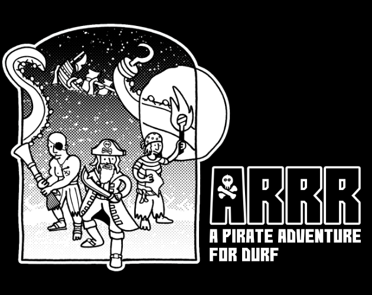
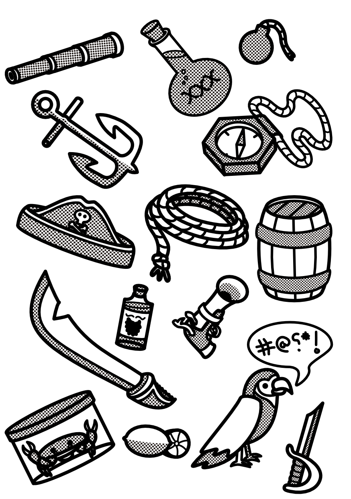
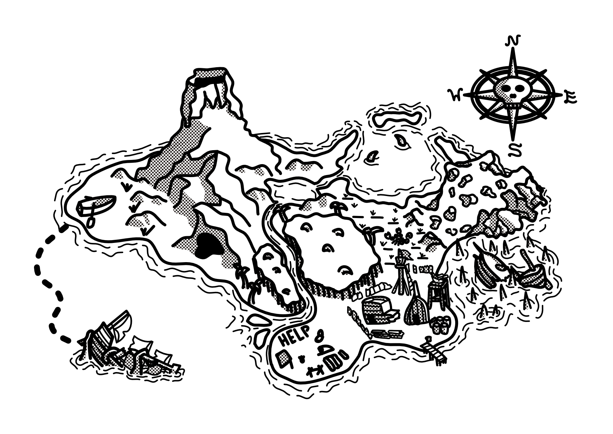
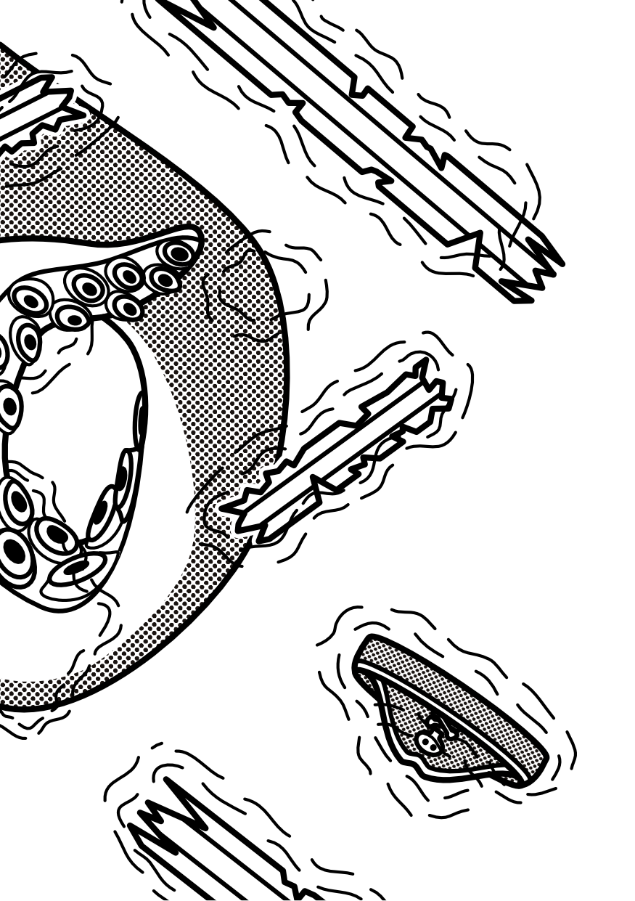

Art and co-design for a TTRPG adventure.

[View on Itch](https://atlasarcane.itch.io/arrr).

<!--truncate-->

Arrr is a pirate supplement for the DURF TTRPG. Arrr was co-designed with Dale Blackburn. I made the cover and art for the game replicating the line-art and halftone style of Emiel Boven in DURF.

