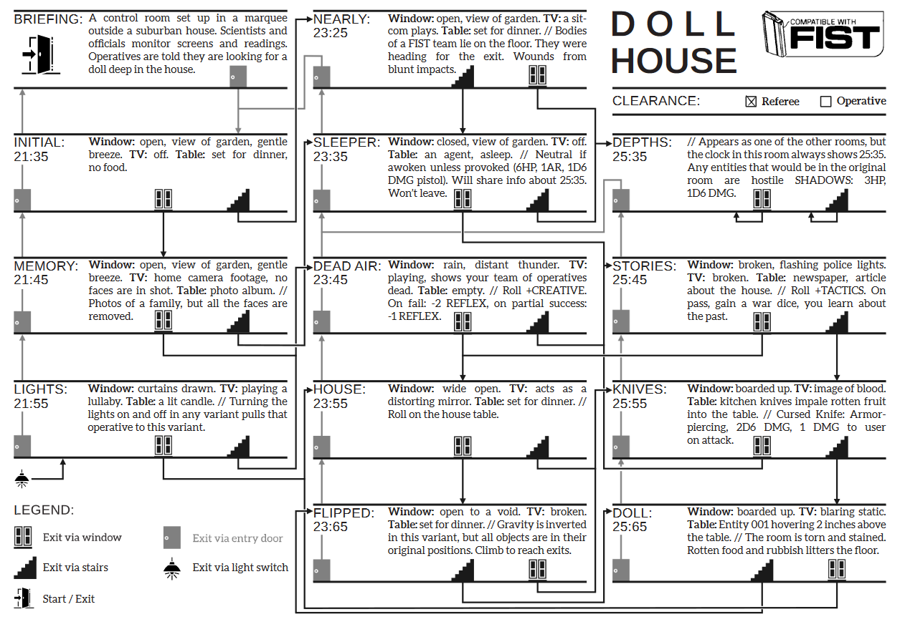
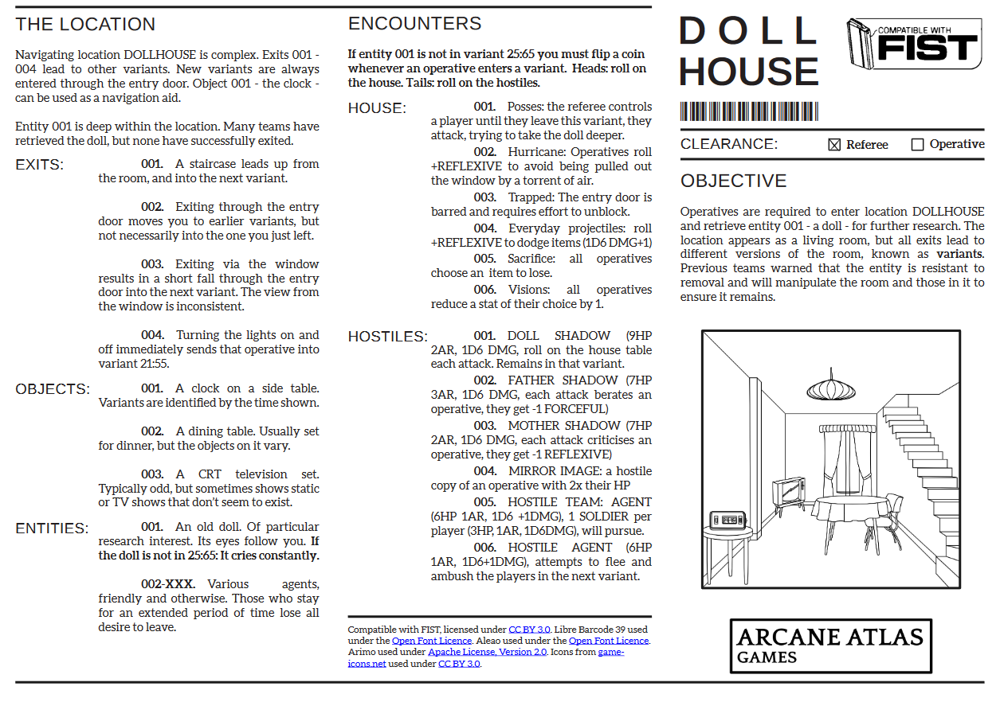

Writing, design and layout for a TTRPG supplement.

[View on Itch](https://atlasarcane.itch.io/fist-dollhouse).

<!--truncate-->

Dollhouse is a 1-page scenario for the FIST TTRPG (a cold-war sci-fi/pulp game). To fit the scenario on a single page required a condensed flow-chart-like map with a repeated structure to enable the game master to quickly interpret each room and the players path through the scenario.

