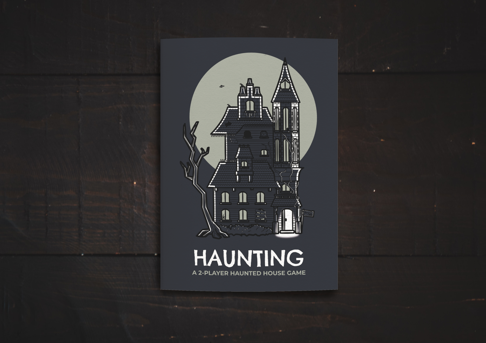
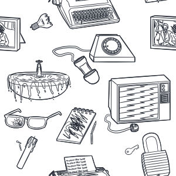
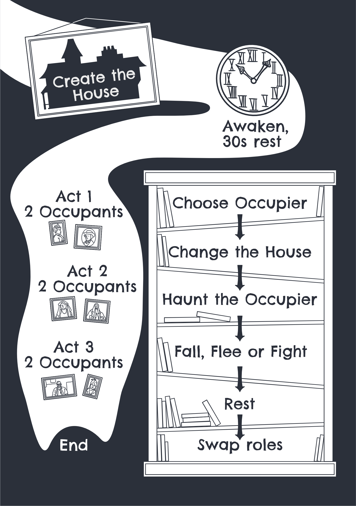

Art and co-design for a TTRPG.

[View on Itch](https://atlasarcane.itch.io/haunting).

<!--truncate-->

Haunting is a 2-player TTRPG telling the story of a haunted house across a number of inhabitants. Haunting was co-designed with Dale Blackburn. I made the cover and art for the game choosing a simple line-art style to capture distressed everyday objects and cobwebs.

