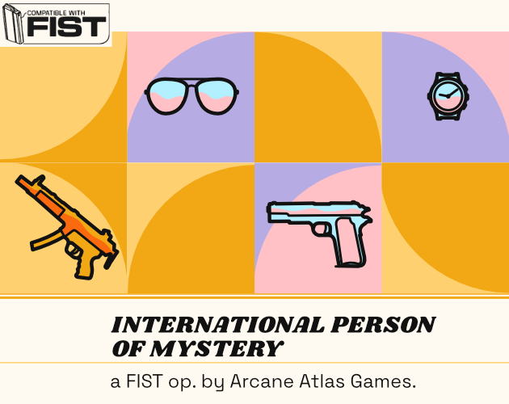

Layout, writing and design for a TTRPG supplement.

[View on Itch](https://atlasarcane.itch.io/the-only-agent-left).

<!--truncate-->

FIST is a TTRPG capturing cold war sci-fi pulp action. In The Only Agent Left I wanted to capture the clumsy spy trope inspired by films like Johnny English. This was achieved mechanically by separating players into The Agent and Sidekicks. The design was inspired by the early parts of the film The Incredibles and penguin book covers. The Only Agent Left was edited by Dale Blackburn.

Earlier versions of the game used a more groovy 70's inspired design, but were redesigned due to concerns about how well the source material had aged.

