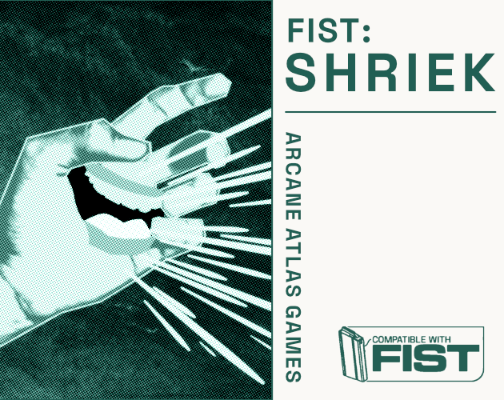
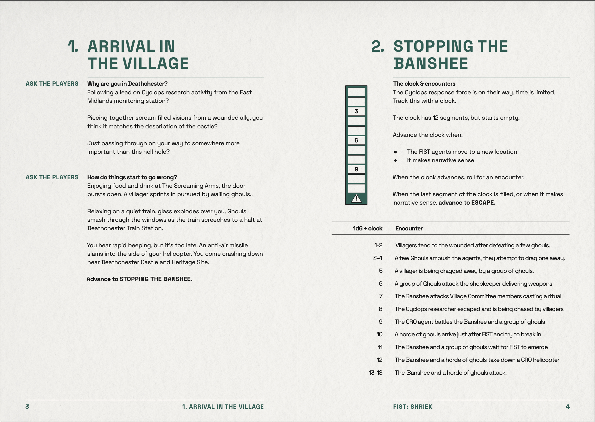

Layout, writing and design for a TTRPG supplement.

[View on Itch](https://atlasarcane.itch.io/fist-shriek).

<!--truncate-->

FIST is a TTRPG capturing cold war sci-fi pulp action. In Shriek I intended to create a small-town, bleak UK one-shot, that left space for the game master to get creative. Shriek was edited by Dale Blackburn, and was helped by layout feedback from the Explorers Design discord.

